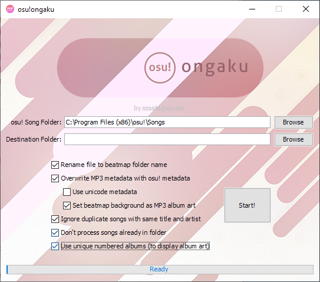

# osu!ongaku
This program lets you export your osu! songs as mp3's with metadata from their respective beatmaps.

### Features:
- Overwrite existing metadata with metadata from beatmap file (.osu file)
- Supports unicode metadata ("Use unicode metadata" in program equivalant to "Prefer metadata in original language" option in game)
- Applies beatmap background as mp3 album art (takes STD or CTB background => crop to square => downsize to 500x500 => apply to mp3 as imbedded tag)

### Process:

I highly recommended to backing up your osu!/songs folder before you begin, or copying your osu!/songs folder elsewhere and using that in the program instead just to be safe.

1. Run the excecutable jar (requires Java SE 8 or later).
2. Select your osu!/songs folder. For example: "C:\Program Files (x86)\osu!\Songs", or wherever you copied it.
3. Select your desired destination folder. This is where the songs will end up.
4. Choose your options (hover for info).
5. Press Start! The first half of the process involves the program searching through the songs folder, and the second half involves applying metadata/album art and saving the mp3 file.

Have fun with it!
